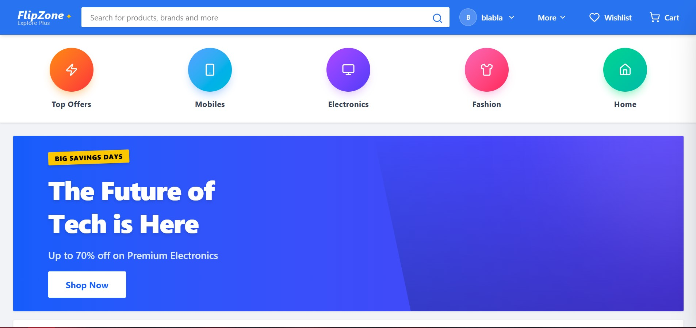
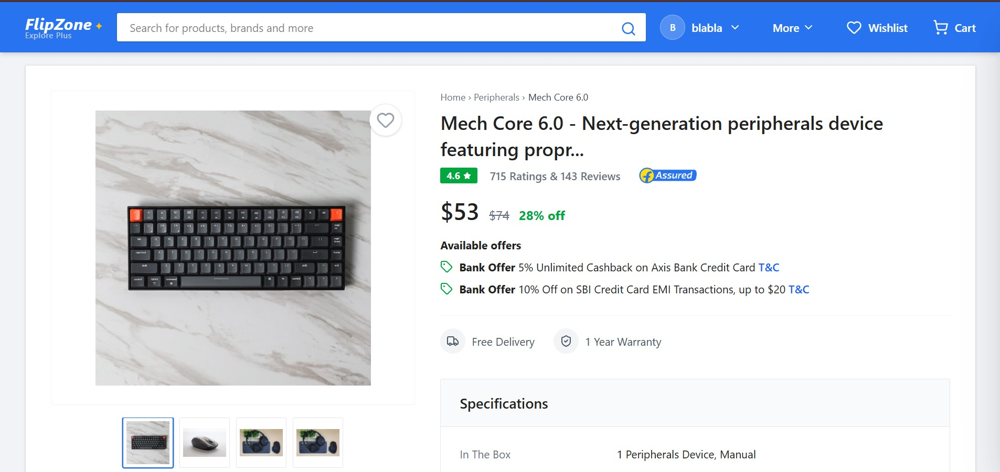
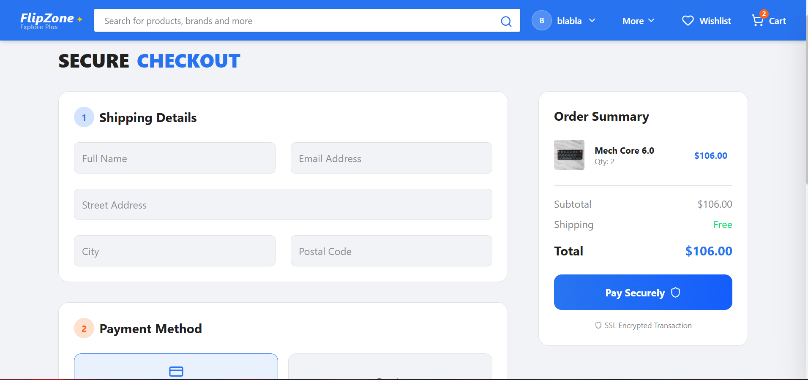

# 🛒 FlipZone — Modern E-Commerce Web Application


> FlipZone is a high-fidelity, fully responsive e-commerce platform designed to replicate the performance and UX of real-world shopping apps. It features advanced filtering, real-time state management, a clean design system, and a complete checkout flow using modern React architecture.

---

## 🔗 Live Demo
👉 **https://flipzonekk.vercel.app/**

---

## 📸 Screenshots





---

## ✨ Key Features

### 🛍️ Browsing & Discovery
- Dynamic product grid with advanced filtering (Category, Price, New Arrivals)
- Real-time smart search with URL-based parameters
- Sorting by relevance, price, and newest
- Interactive gradient category navigation strip

### 📦 Product Experience
- Rich product detail page with image gallery and thumbnails
- Review & rating system (persisted locally)
- Wishlist with one-tap heart animation (Redux persisted)
- Carousel for related products

### 🛒 Cart & Checkout
- Slide-out cart sidebar for seamless UX
- Full checkout flow with validation
- Simulated payments + order confirmation
- Order History dashboard
- LocalStorage persistence (Cart, Wishlist, Orders)

### 🎨 UI/UX
- Fully responsive design (mobile-first)
- GSAP scroll animations + custom keyframes
- INR (₹) currency formatting with locale rules
- Smooth navigation transitions

---

## 🛠 Tech Stack

- **Frontend:** React (Vite)
- **State Management:** Redux Toolkit
- **Routing:** React Router v6
- **Styling:** Tailwind CSS
- **Icons:** Lucide React
- **Animations:** GSAP + Tailwind Animate
- **Deployment:** Vercel

---

## 📂 Project Structure

src/
├── components/ # Reusable UI elements
├── context/ # Legacy optional context systems
├── data/ # Mock product + category data
├── pages/ # Home, ProductDetails, Checkout, Orders
├── store/ # Redux Toolkit slices
│ ├── authSlice.js
│ ├── cartSlice.js
│ ├── orderSlice.js
│ └── wishlistSlice.js
├── App.jsx
└── main.jsx

yaml
Copy code

---

## 🚀 Getting Started

### Prerequisites
- Node.js 16+
- npm or yarn

### Installation

Clone the repo:
```bash
git clone https://github.com/karankumar-ghub/Flipzone.git
cd Flipzone
Install dependencies:
```

```bash
Copy code
npm install
Start the development server:
```
```bash
Copy code
npm run dev
```
Open in browser:
👉 [flipzone](https://flipzonekk.vercel.app/)

🧠 Architectural Decisions
Why Redux Toolkit?
E-commerce applications require complex state flows — cart, wishlist, orders, filters, sorting, and authentication.
Redux Toolkit:

Prevents unnecessary re-renders

Organizes logic into slices

Makes the code scalable & maintainable

URL-Synced Filtering
All search & filter functions update the URL (e.g., ?search=shoes&category=men), so:

Users can share exact product views

Search results are bookmarkable

UX feels more modern and predictable

Better SEO compatibility

Mock Data & Local Persistence
Mock JSON simulates a backend

LocalStorage ensures cart, wishlist & orders persist

Works offline & behaves like a real e-commerce system

🧪 Roadmap
Admin Dashboard (Add/Edit Products)

Backend API Integration (Node/Next.js)

JWT Authentication

Payment Gateway Integration

Recommendation Engine (ML-powered)

📝 License
This project is licensed under the MIT License.

💙 Built with passion by
Karan Kumar (TheAIKaran)
